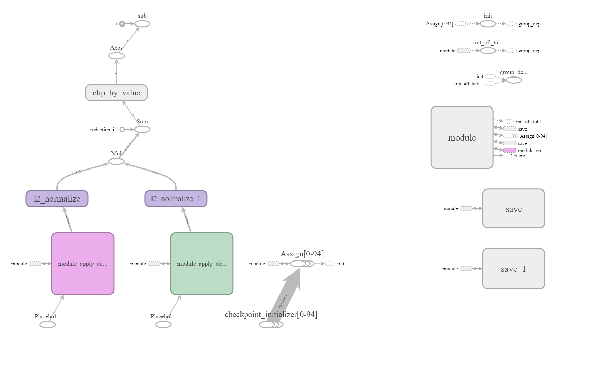

# Auto Text Summarization

[full code documentation](https://idanmoradarthas.github.io/text-summarization/)

```
Automatic summarization is the process of shortening a text document with software, in order to create a summary 
with the major points of the original document.
```
--Wikipedia

This project was inspired by work of Praveen Dubey in 
[Understand Text Summarization and create your own summarizer in python](https://towardsdatascience.com/understand-text-summarization-and-create-your-own-summarizer-in-python-b26a9f09fc70).

The summarization uses the Universal Sentence Encoder[1] with the deep learning framework of TensorFlow, SpaCy for 
linguistic and NetworkX for ranking. The project itself is a RestAPI script build with Flask framework.

The algorithm steps are as follows:
1. Read the given text and splitting it into sentences using SpaCy.
2. Generate sentences pairs cosine similarity score based on their dimensional vectors with TensorFlow graph and the 
Universal Sentence Encoder as an embedding layer (see network architecture picture below).
3. Generate similarity matrix across the sentences and rank them using NetworkX implementation of PageRank.
4. Sort the rank sentences and pick the top ones according the user's input. 

## TensorFlow graph with the Universal Sentence Encoder


## Install and run project
build with ```python==3.7.3``` and ```tox==3.12.0```.

```
git clone https://github.com/idanmoradarthas/text-summarization.git
cd text-summarization
pip install -r requirements.txt
python app.py 
```

the app will run on 0.0.0.0:8080

## Interface v1.0
### Request and Response
Request Should be constructed as such and send in method POST:
```json
{
  "doc": text,
  "summarized sentences length": number of sentences that will comprised the summary
}
```
where each document will be in separate brackets.

The API is exposed in route "/summarize/v1.0". so the full address should be ```<IP>:8080/classify/v1.0```

For example:

For the following text:
```
In an attempt to build an AI-ready workforce, Microsoft announced Intelligent Cloud Hub which has been launched to 
empower the next generation of students with AI-ready skills. Envisioned as a three-year collaborative program, 
Intelligent Cloud Hub will support around 100 institutions with AI infrastructure, course content and curriculum, 
developer support, development tools and give students access to cloud and AI services. As part of the program, the 
Redmond giant which wants to expand its reach and is planning to build a strong developer ecosystem in India 
with the program will set up the core AI infrastructure and IoT Hub for the selected campuses. The company will 
provide AI development tools and Azure AI services such as Microsoft Cognitive Services, Bot Services and Azure 
Machine Learning. According to Manish Prakash, Country General Manager-PS, Health and Education, Microsoft India, 
said, "With AI being the defining technology of our time, it is transforming lives and industry and the jobs of 
tomorrow will require a different skillset. This will require more collaborations and training and working with AI. 
That’s why it has become more critical than ever for educational institutions to integrate new cloud and AI 
technologies. The program is an attempt to ramp up the institutional set-up and build capabilities among the 
educators to educate the workforce of tomorrow." The program aims to build up the cognitive skills and in-depth 
understanding of developing intelligent cloud connected solutions for applications across industry. Earlier in 
April this year, the company announced Microsoft Professional Program In AI as a learning track open to the public. 
The program was developed to provide job ready skills to programmers who wanted to hone their skills in AI and data 
science with a series of online courses which featured hands-on labs and expert instructors as well. This program 
also included developer-focused AI school that provided a bunch of assets to help build AI skills.
```
(source: [analyticsindiamag.com](https://www.analyticsindiamag.com/microsoft-launches-intelligent-cloud-hub-to-upskill-students-in-ai-cloud-technologies/))

we will give the following request (replace <input_text> with the text above)
```json
{
   "doc": "<input_text>",
   "summarized sentences length": 3
}
```

The response will be 
```json
{
  "summarized text": "summarized text"
}
```

For example:

The returned summarized text from the above request will be:
```
In an attempt to build an AI-ready workforce, Microsoft announced Intelligent Cloud Hub which has been launched to 
empower the next generation of students with AI-ready skills. The company will provide AI development tools and 
Azure AI services such as Microsoft Cognitive Services, Bot Services and Azure Machine Learning. The program 
was developed to provide job ready skills to programmers who wanted to hone their skills in AI and data science 
with a series of online courses which featured hands-on labs and expert instructors as well.
```

## References
[1] Daniel Cer, Yinfei Yang, Sheng-yi Kong, Nan Hua, Nicole Limtiaco, Rhomni St. John, Noah Constant, Mario 
Guajardo-Céspedes, Steve Yuan, Chris Tar, Yun-Hsuan Sung, Brian Strope, Ray Kurzweil. 
[Universal Sentence Encoder](https://arxiv.org/abs/1803.11175). arXiv:1803.11175, 2018.